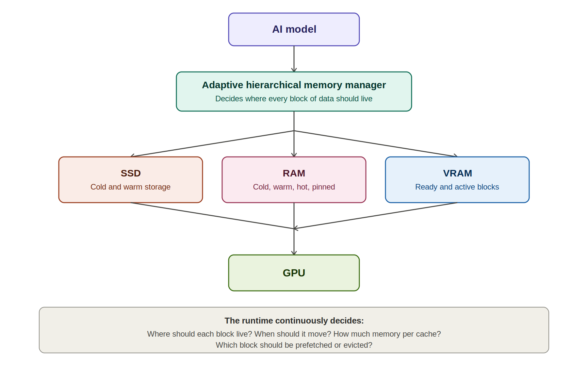
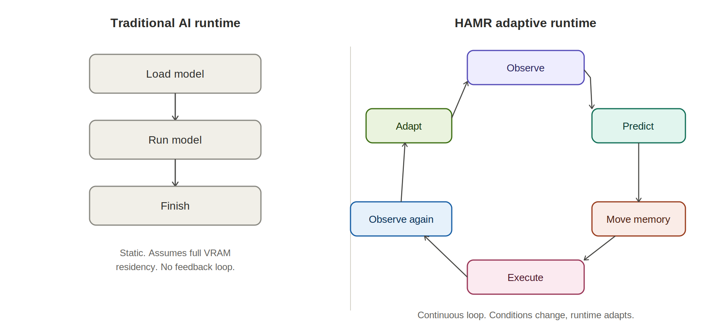
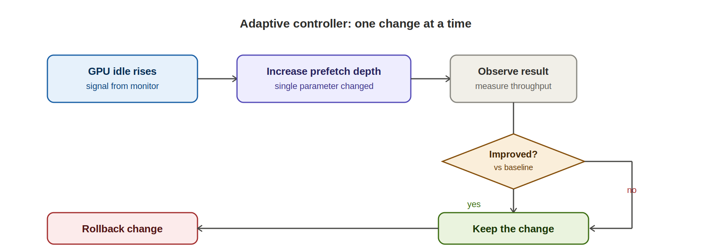
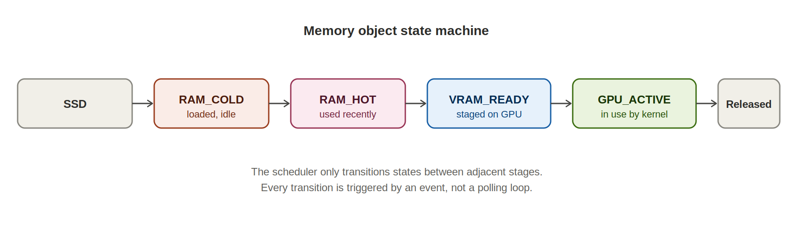
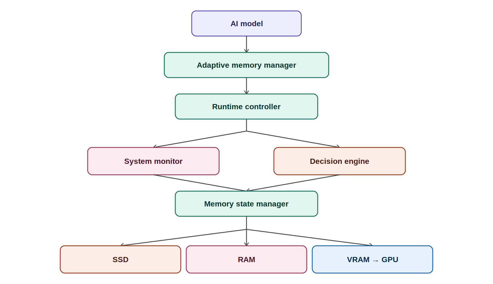

**HAMR**

Hierarchical Adaptive Memory Runtime

*An Adaptive Hierarchical AI Memory Manager for running and training large models across SSD, RAM, VRAM, and GPU*

Full project concept document

# Contents

# 1. What this project actually is

HAMR began as an idea inspired by how GTA 6 reportedly streams game assets on and off disk in real time, rather than loading everything into memory up front. The original question was simple: could the same idea apply to AI models, streaming weights from SSD into VRAM instead of requiring an entire model to sit in GPU memory before it can run.

The project has since grown into something broader. It is no longer just a weight-streaming trick for one model. It is a general-purpose memory manager that treats a computer's entire storage and memory hierarchy, SSD, RAM, VRAM, and GPU, as a single adaptive system that decides in real time where every piece of AI data should live.

**Two things are important to separate clearly, because they sit at different levels of certainty:**

* The core runtime idea, streaming and managing memory blocks adaptively across a hierarchy, is technically plausible and grounded in well-understood operating system concepts such as virtual memory, caching, and prefetching.
* Some of the more ambitious future claims, such as improving training accuracy or outperforming all existing inference runtimes, are hypotheses. They have not been demonstrated yet and would need real experiments before anyone should rely on them.

This document describes the full idea as it stands today: the philosophy, the architecture, what the system manages, how it makes decisions, what has already been learned from early experiments, and the roadmap to get from a working prototype to the more ambitious long-term vision.

# 2. Core vision

Almost every AI inference and training runtime today makes the same assumption: that the entire model, and everything needed to run it, must fit inside GPU memory (VRAM) before anything can happen. If the model does not fit, the only options are to buy a bigger GPU, use multiple GPUs, or reduce the model's precision until it shrinks enough to fit.

HAMR rejects that assumption. Instead of treating VRAM as the only place a model can live, it treats the entire machine, SSD, RAM, VRAM, and GPU compute, as one continuous memory hierarchy. Different pieces of data move up and down that hierarchy depending on how urgently they are needed.

*Figure 1. The model sits on top of an adaptive memory manager, which continuously routes data across SSD, RAM, and VRAM on its way to the GPU.*

At every moment, the runtime is answering a small set of questions for every block of data it is responsible for:

* Where should this block live right now: SSD, RAM, or VRAM?
* When should it move to the next tier?
* How much memory should each cache tier be allowed to use?
* Which block is likely to be needed next, and should it be prefetched early?
* Which block has gone cold and should be evicted to make room?

# 3. Main philosophy: from static loading to continuous adaptation

Most AI runtimes follow a simple, static lifecycle: load the model, run the model, finish. That works fine when the model comfortably fits in memory and conditions never change. It breaks down the moment the model is too large, the hardware is shared with other applications, or storage performance varies over time.

HAMR replaces that static lifecycle with a continuous loop. The system never assumes it has finished learning about its environment. It keeps observing, predicting, moving data, executing, and adjusting, indefinitely, for as long as it is running.

*Figure 2. The traditional load-then-run lifecycle on the left compared with HAMR's continuous observe-predict-adapt loop on the right.*

This is the single biggest philosophical shift in the project: a runtime that behaves more like an operating system's memory manager, constantly reacting to real conditions, rather than a script that executes a fixed plan.

# 4. What the runtime manages

HAMR does not treat all data the same way. Different kinds of AI data have very different access patterns, lifetimes, and tolerance for being moved around, so the runtime manages each type with its own policy.

## 4.1 Model weights

Weights are read-only and streamed through the hierarchy in a predictable direction: SSD, then RAM, then VRAM, then GPU, and eventually unloaded once no longer needed. Because they never change during inference, weights are the easiest object type to stream and the natural starting point for the project.

## 4.2 KV cache (conversation memory)

The key-value cache used during text generation behaves completely differently from weights. It is generated on the fly, grows continuously as a conversation lengthens, can be compressed, and may need to be moved or reloaded depending on memory pressure. HAMR treats it as its own object type with its own lifecycle: generate, keep, grow, compress, move, and reload if needed.

## 4.3 Activations

Activations are short-lived intermediate values produced during a forward pass. Their lifecycle is intentionally simple: create, use, and delete. They are not meant to persist, so the runtime does not spend effort trying to optimize their placement beyond keeping them close to the compute that needs them.

## 4.4 Gradients and optimizer states (training only)

These object types only exist during training and fine-tuning. Gradients are produced during the backward pass, and optimizer states (such as momentum and variance terms in Adam) persist across training steps. Both add substantial memory pressure on top of the weights themselves, which is exactly the kind of pressure HAMR's hierarchy is designed to absorb.

# 5. Memory hierarchy structure

Within each physical tier, SSD, RAM, and VRAM, HAMR defines logical regions that describe how recently and how urgently a block of data has been used. These regions are not separate physical memories. They are different logical states that a block can occupy within the same tier.

|  |  |
| --- | --- |
| **Tier** | **Logical regions** |
| SSD | Cold storage, warm storage, read queue |
| RAM | Cold blocks, warm blocks, hot blocks, ready queue, pinned memory |
| VRAM | Incoming queue, ready blocks, active blocks, eviction queue |

A block moves between these logical regions as its priority changes. A block sitting in RAM cold blocks that suddenly becomes relevant moves to warm, then hot, then into the VRAM incoming queue, all without ever changing which physical chip it lives on until it actually needs to cross a bus.

# 6. Runtime monitor

None of the adaptive decisions described in this document are possible without continuous, accurate measurement of the system's real condition. The runtime monitor is the component responsible for collecting that data, across every layer of the hardware, on an ongoing basis.

|  |  |
| --- | --- |
| **Category** | **Signals collected** |
| Storage (SSD) | Latency, bandwidth, read queue depth |
| RAM | Free RAM, cache usage, pinned memory |
| GPU | Utilization, idle time, VRAM usage, compute latency |
| PCIe | Transfer latency, bandwidth |
| System | CPU usage, temperature, power draw, battery level where relevant |

These signals feed directly into the adaptive controller described next. Without reliable monitoring, the controller would be making decisions blind.

# 7. Adaptive controller

The adaptive controller is the decision-making core of HAMR. Its design follows one strict rule: change exactly one parameter at a time, observe the measured effect, and only keep the change if it actually helped. This is deliberately conservative. A system that changes many parameters simultaneously cannot tell which change caused which effect, and becomes nearly impossible to debug or trust.

Parameters the controller is allowed to adjust include:

* Block size, how large each streamed unit of data is
* RAM cache size
* VRAM cache size
* Prefetch depth, how far ahead the system looks to stage data early
* Eviction policy, which rule decides what gets removed when space is needed
* Pinned memory pool size

*Figure 3. Example control loop: rising GPU idle time triggers a single parameter change, the result is measured, and the change is kept only if it measurably helps.*

If a change does not improve measured performance, it is rolled back immediately. Over time, this produces a system that gradually tunes itself to the specific hardware it is running on, without any manual configuration from the user.

# 8. Dynamic memory budget

HAMR is designed to never assume it owns the entire machine. Real computers run other applications at the same time, and a memory manager that grabs every available byte will eventually crash the system or starve other processes.

Instead, the runtime continuously computes a safe budget from whatever is actually free, and shrinks its own cache the moment that free space drops. A representative example:

|  |  |
| --- | --- |
| **Condition** | **Resulting behavior** |
| Total RAM: 16 GB, available: 9 GB | Safe budget computed as 6 GB; HAMR cache capped at 6 GB |
| Another application starts, free RAM drops to 3 GB | HAMR shrinks its cache immediately and keeps running |

The same logic applies to VRAM. This is what allows HAMR to coexist with other workloads on the same machine rather than requiring exclusive access to the GPU.

# 9. State machine

Every individual memory object inside HAMR, whether it is a weight block, a KV cache segment, or an activation, has a well-defined state at all times. The scheduler's job is narrow and disciplined: it only ever moves an object from one defined state to an adjacent one. It never skips states and never invents ad hoc transitions.

*Figure 4. The lifecycle of a single memory object as it is promoted from cold storage through to active GPU use, and eventually released.*

This explicit state machine is what makes the system's behavior predictable and debuggable, even though the underlying decisions about when to transition are adaptive.

# 10. Event-driven runtime

HAMR does not poll. Polling, repeatedly checking whether something is ready, wastes CPU cycles and adds latency. Instead, every transition in the system is triggered by an event fired the moment a prior step completes.

A representative event chain looks like this:

1. SSD\_DONE, the read from disk has completed
2. RAM\_READY, the block is now resident and usable in RAM
3. VRAM\_COPY, the block begins copying across PCIe into VRAM
4. GPU\_START, the GPU begins computing using that block
5. GPU\_DONE, computation using that block has finished
6. PREFETCH\_NEXT, the system uses this moment to begin staging the next block it predicts will be needed

This event-driven design is also what allows loading and computation to overlap, which is central to the pipelining work described in the roadmap.

# 11. Scheduler

The scheduler is expected to evolve through several stages of sophistication as the project matures, rather than arriving fully formed:

* FIFO, the simplest possible starting point, blocks are handled strictly in the order requested
* Static prefetch, a fixed, hand-tuned lookahead is added once basic streaming works
* Adaptive, the lookahead and other parameters begin adjusting themselves based on the controller described in section 7
* Risk-aware, the most advanced stage, where scheduling decisions explicitly account for the uncertainty in how long a transfer will take, not just its average expected duration

# 12. Risk model: from cost to risk

Early in the project the natural way to think about scheduling decisions was in terms of cost, roughly, how long will this operation take. As experiments progressed, this framing turned out to be incomplete. The more important question is not how long something usually takes, but how uncertain that duration is.

Early experiments pointed to a clear and useful pattern:

* SSD latency is stochastic, meaning it varies meaningfully from one read to the next rather than being a fixed, predictable number.
* PCIe transfers, by comparison, are far more stable and predictable once a transfer has started.

Because of this, the adaptive logic in HAMR is deliberately weighted toward managing the SSD-to-RAM transition carefully, since that is where the dominant source of unpredictability lives. The PCIe and RAM-to-VRAM stages need less adaptive attention because they behave consistently.

# 13. Research results so far

The architectural choices described in this document were not arbitrary. They were shaped directly by early experimental observations, summarized honestly here:

* SSD latency is stochastic, confirming the risk model described above.
* PCIe transfers are comparatively stable across repeated tests.
* For the kernels tested so far, GPU execution is substantially faster than the time it takes to transfer data from storage.
* In the measured setup, storage behavior, not GPU compute, is the dominant source of uncertainty and delay.

These are early, narrow findings from a specific test setup. They are reported honestly as directional evidence that shaped the architecture, not as a comprehensive or final performance characterization. Broader experiments across different hardware would be needed before generalizing them.

# 14. Proof of concept: the immediate goal

It is worth being explicit that the project's near-term goal is intentionally modest. The aim right now is not to build the fully adaptive, self-tuning runtime described throughout this document. It is to prove the basic mechanism works correctly, before any adaptive intelligence is layered on top.

1. Split a model into streamable blocks
2. Stream those blocks from SSD through RAM into VRAM
3. Produce output identical to running the unmodified model fully resident in VRAM
4. Reduce the VRAM footprint required to run the model
5. Keep the model running correctly throughout, with no crashes or corrupted state

Only once this proof of concept is solid should adaptive behavior, prefetching intelligence, and risk-aware scheduling be added on top. This ordering matters: a correct but dumb system is a far better foundation than a clever system that occasionally produces wrong output.

# 15. Training support (future direction)

Inference only requires managing one type of object: weights. Training is considerably heavier, requiring weights, gradients, optimizer states, and activations to all be managed simultaneously, often at multiples of the base model's memory footprint.

The same underlying memory manager described throughout this document could, in principle, extend to manage all of these object types during training as well. However, this is explicitly a hypothesis rather than a proven capability. Whether this approach actually improves training throughput, stability, or the maximum model size trainable on a given machine needs to be demonstrated experimentally before it can be claimed as a benefit.

# 16. Fine-tuning

Fine-tuning, particularly parameter-efficient approaches such as LoRA, follows the same underlying concept as full training but at a smaller scale. Rather than keeping LoRA weights, their optimizer states, and activations permanently resident in VRAM, the runtime would decide dynamically where each of these should live based on the same hierarchy and adaptive logic used elsewhere in the system.

# 17. Large models: a potential capability

If the proof of concept and the adaptive layers above it both work as intended, one natural extension is running models far larger than would normally fit on a given GPU, for example a 400 billion parameter model streamed through SSD, RAM, and VRAM on a machine that could never hold such a model in VRAM alone.

This is framed deliberately as a potential capability rather than a guarantee. The achievable performance in that scenario depends heavily on the specific hardware involved and on how effective the adaptive scheduling strategy turns out to be in practice. A correct implementation that runs a 400B model slowly is a real and useful result; claiming it will run fast without evidence would not be honest.

# 18. Adaptive learning (not machine learning)

It is worth clarifying explicit terminology here, since the word “adaptive” could be misread as implying the runtime trains a neural network to manage itself. That is not what is meant. The adaptive learning in HAMR is systems learning: the runtime observes patterns in SSD behavior, GPU behavior, and RAM availability over time, and continuously adjusts its own parameters in response. This is closer to how an operating system's page replacement algorithm adapts than to anything resembling a trained AI model.

# 19. Long-term architecture

Pulling every component described above together, the long-term architecture organizes into a small number of clearly separated layers, each with a narrow responsibility.

*Figure 5. The full architecture: a runtime controller coordinates a system monitor and decision engine, which together drive a memory state manager responsible for moving data across SSD, RAM, VRAM, and the GPU.*

The separation between the system monitor (which only observes) and the decision engine (which only decides) is intentional. It keeps measurement logic and policy logic independent, which makes the system easier to test, easier to reason about, and easier to extend with smarter policies later without touching the monitoring code at all.

# 20. Development roadmap

The project is structured as five sequential phases. Each phase is meant to produce a working, testable system on its own, rather than requiring the entire vision to be built before anything can be evaluated.

|  |  |
| --- | --- |
| **Phase** | **Goal** |
| A — Working runtime | Stream model weights from SSD through RAM into VRAM and produce correct, identical outputs compared with a fully VRAM-resident model. |
| B — Pipeline | Overlap data loading with GPU computation so the GPU is not left idle waiting for the next block to arrive. |
| C — Monitoring | Build the runtime monitor described in section 6 and measure the whole system, storage, RAM, GPU, PCIe, in real time. |
| D — Adaptive controller | Introduce the one-parameter-at-a-time controller from section 7, changing settings only when measurements confirm an improvement, and rolling back otherwise. |
| E — Training support | Extend the same memory manager to handle gradients, optimizer states, and activations for training and fine-tuning workloads. |

# 21. What makes this different

Streaming model weights from disk is not, by itself, a new idea, versions of it already exist in various forms across the ecosystem. Framed only as weight streaming, this project would be an incremental contribution at best.

The more distinctive idea, and the one worth defending, is treating the entire AI memory hierarchy, SSD, RAM, VRAM, and GPU, as one adaptive system that continuously observes real hardware conditions, respects the resource budgets of other applications running on the same machine, and dynamically decides where every kind of AI data, weights, KV cache, activations, gradients, and optimizer states, should reside at any given moment.

A meaningful, demonstrable contribution would be showing that this adaptive manager:

* Consistently reduces VRAM requirements compared with naive full-residency loading
* Runs correctly across diverse hardware without requiring manual, per-machine tuning
* Maintains output identical to the unmodified model at all times

Beyond that baseline, whether the system also improves throughput, enables meaningfully larger models to run on modest hardware, or provides real benefits during training are the next hypotheses to test, in that order, once the proof of concept described in section 14 is working and verified.

*End of document*